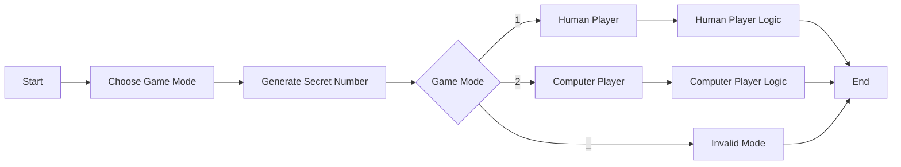
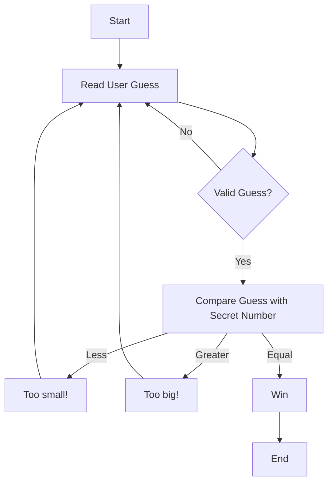
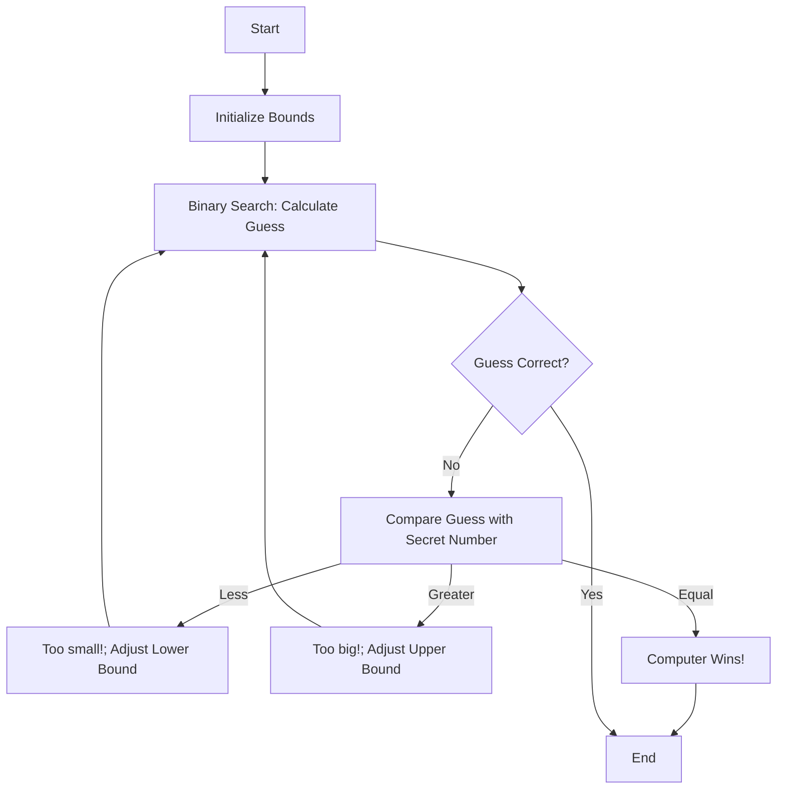

# guessing_game
> A simple command-line guessing game written in Rust where the user can choose to play as a human player or let the computer guess the randomly generated number between 1 and 100.

This is a fun and simple project to get started with Rust. The program generates a random number between 1 and 100. The user can select a mode to either play the game as a human player or let the computer attempt to guess the number. The game will provide feedback whether the guess is too high, too low, or correct.

This project is a modified version of the guessing game from Chapter 2 of "The Rust Programming Language" book.
## Table of Contents
- [Game Mechanics](#game-mechanics)
- [Installation](#installation)
- [Usage](#usage)
- [Example Gameplay](#example-gameplay)

## Game Mechanics

### High-Level Flow


### Human Player Logic


### Computer Player Logic



## Installation
1. Ensure you are in the `guessing_game` directory:
```bash
cd learn-rust/guessing_game
```

2. Build the project
```bash
cargo build
```

## Usage
To run the guessing game, execute the following command in the project directory:
```bash
cargo run
```
Follow the prompts to select the mode and guess the number between 1 and 100.

## Example Gameplay

### Human Player Mode

### Computer Player Mode